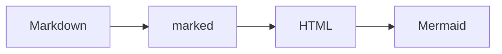
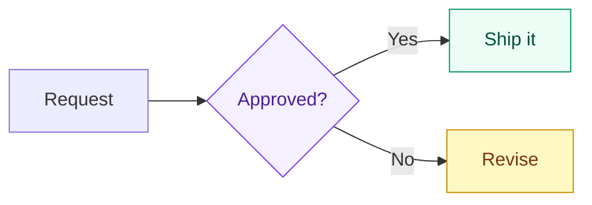
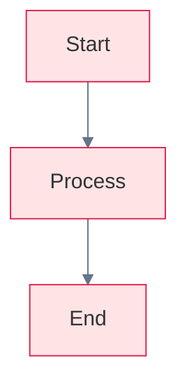

# Markdown KIT Demo

This file is rendered by the **Markdown KIT** Chrome extension when opened in the browser.

## Features

- Renders `.md` URLs automatically
- GitHub-flavored markdown
- Mermaid diagrams and KaTeX math
- Light and dark themes (follows system preference)

## Mermaid diagram



## Mermaid colors

Per-node colors via `classDef` (Mermaid's recommended styling API):



Per-diagram palette via frontmatter `themeVariables` (requires `theme: base`):



## Math

Inline: $E = mc^2$

Display:

$$\int_0^1 x^2 \, dx = \frac{1}{3}$$

## Code sample

```javascript
const greeting = "Hello, markdown!";
console.log(greeting);
// Dollar signs in code are not math: $x^2$
```

## Table

| Column | Value |
| ------ | ----- |
| URL    | Current browser tab |
| Parser | marked |

## List

1. Load the extension in `chrome://extensions`
2. Open this file in Chrome
3. See formatted output

> Enable **Allow access to file URLs** for local `file://` markdown files.
